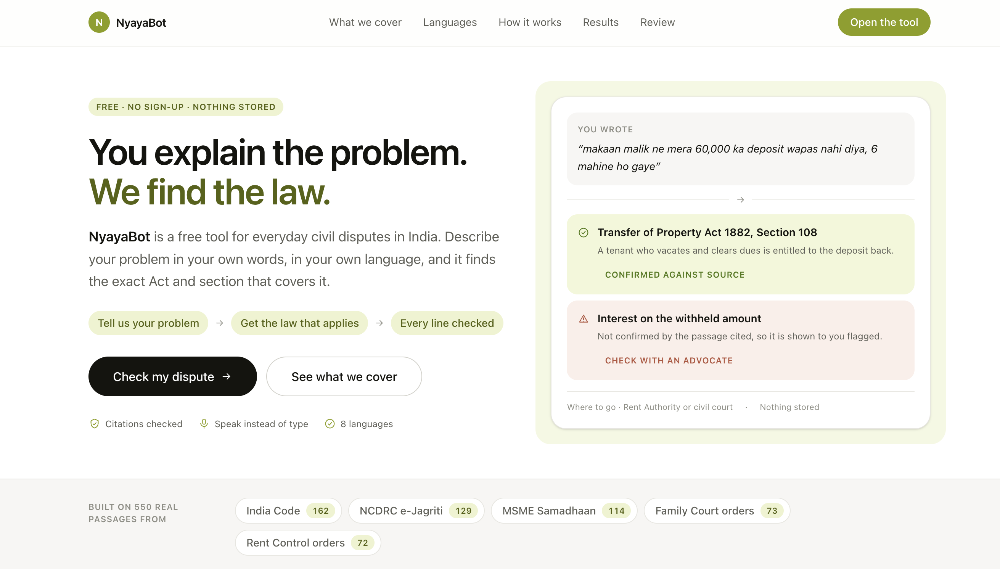
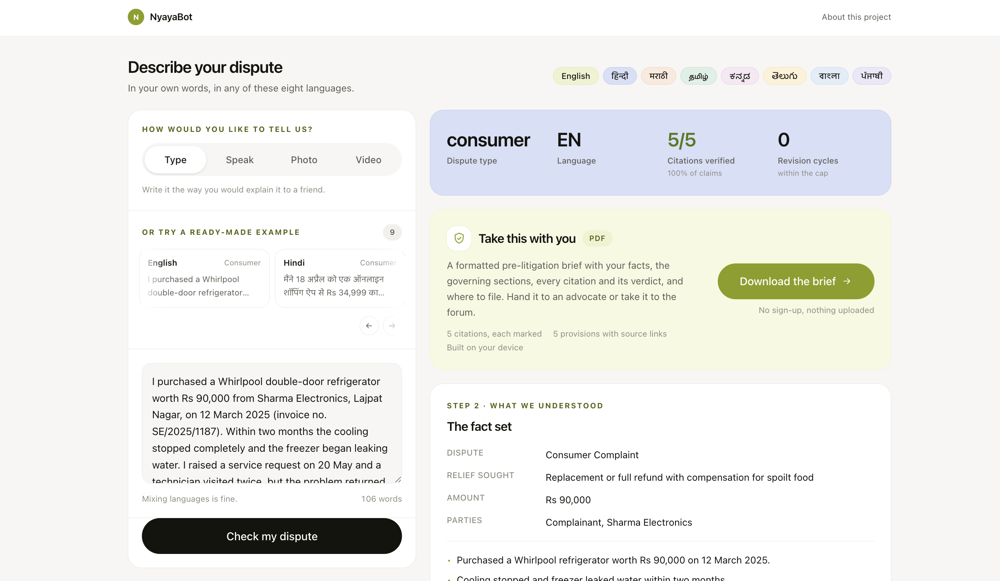

# Suraj Anand

### Lead Backend Engineer · AI/ML Architect · GenAI Systems Builder

**9+ years** building high-scale distributed systems · **2x Jeff Bezos Award Winner** · **Published IET Researcher** · **M.Tech AI/ML @ BITS Pilani**

---

## Expertise Areas

---

## About

Lead Backend Engineer with 9+ years of experience delivering production systems across media and entertainment(UGC), SaaS, fintech, e-commerce, and renewable energy. Currently specializing in GenAI-first architectures: RAG pipelines, multi-agent systems, and LLM-powered applications at scale.

Co-architected Nojoto, India's leading multilingual storytelling platform, scaling it from 10K to 20M+ users and Rs 12Cr ARR. Built Elasticsearch infrastructure handling 225M documents at sub-50ms latency, a 30x performance improvement. Led a team of 8 engineers managing 200K+ daily messages and 50TB of media.

Pursuing an M.Tech in Artificial Intelligence & Machine Learning at BITS Pilani, bridging academic rigor with hands-on production experience.

---

## Key Achievements

- **Scaled Nojoto** from 10K to 10M+ users and 2M+ creators, raising Rs 26Cr in funding; recognized by **Google (#WeArePlay)**, **MeitY Top 100 Startups 2022**, and **YourStory Tech30**
- **Built Elasticsearch infrastructure** for 225M documents delivering sub-50ms latency and 30x performance improvement, powering user and content discovery at scale
- **Awarded Jeff Bezos Award for People & Leadership** twice, recognizing outstanding impact in engineering and team development
- **Published IoT research** in IET Electronics Letters: a non-intrusive solar monitoring system for NISE & NIWE, Ministry of New and Renewable Energy · [Read Paper](https://ietresearch.onlinelibrary.wiley.com/doi/epdf/10.1049/el.2017.0694)
- **Advised 50+ startups** on MVP development, engineering team building, and go-to-market strategies
- **Reduced infrastructure costs by 30%** while improving performance by 60% through cloud architecture optimization

---

## Enterprise AI Platforms

Two production-grade GenAI systems architected end-to-end as an M.Tech dissertation at BITS Pilani — not demos or wrappers around off-the-shelf RAG. Each addresses a real problem: hallucinated legal citations in citizen-facing tools, and unverifiable black-box ESG scores in climate finance. Both implement multi-agent pipelines with hallucination-control layers, citation-level grounding verification, and human-in-the-loop governance. Repos are private; architecture deep-dives, measured results, and live walkthroughs available on request.

### NyayaBot — Multilingual Multimodal Legal RAG with Verifiable Citations

A citizen describes a dispute in any of 8 Indian languages — typed, spoken, photographed, or recorded — and gets a plain-language mediation summary where every legal claim is verified against its cited statutory passage. Built as an M.Tech dissertation (BITS Pilani) with two original contributions.

| Contribution | What it solves |
|---|---|
| **SF-MR** (Structured Fact-Set Mediated Retrieval) | Retrieves with a typed fact set rather than raw query text, bridging informal language and formal statutes |
| **Claim-level NLI Verifier** | Tests each citation as an entailment problem; re-drafts failures up to 3 cycles — nothing reaches the user unless it passes |

**Results:** hallucination rate 92.5% → 19.2% (73.3pp); retrieval P@5 +9.0pp over dense baseline (p = 1.7e−04); macro-F1 1.00; κ = 0.771 across 100 validated scenarios.

**Stack:** LangGraph · Whisper ASR · EasyOCR · MuRIL · `mDeBERTa-v3` NLI · ChromaDB · GPT-4o-mini · FastAPI · Next.js

<table>
<tr>
<td width="50%">

**Dispute intake — 8 languages, 4 input modes**

</td>
<td width="50%">

**Every citation verified — 5/5 confirmed**

</td>
</tr>
</table>

<strong>Sample output: Pre-litigation brief NB-20260826-1QES</strong>

**Dispute:** Consumer complaint · Rs 90,000 · Complainant vs Sharma Electronics  
**Relief:** Replacement or full refund with compensation for spoilt food  
**Facts:** Whirlpool refrigerator (invoice SE/2025/1187) purchased 12 March 2025; cooling failed and freezer leaked within two months; two technician visits failed; store declined replacement citing usage issue despite active warranty.

| # | Confirmed claim (entailment 0.99) | Source |
|---|---|---|
| 1 | Defective appliance repeatedly failing within warranty, seller declining replacement = deficiency | District Commission |
| 2 | Same fault recurring within warranty, service centre failing permanent repair = deficiency in service | District Commission |
| 3 | Refusal to refund a paid product = deficiency under s.2(11) | District Commission |
| 4 | Advertising a feature the product lacks = unfair trade practice under s.2(47) | State Commission |
| 5 | Charging above printed MRP = unfair trade practice | State Commission |

**5/5 citations confirmed · 0 revision cycles · File at:** [e-Jagriti portal](https://edaakhil.nic.in)

> *Pre-litigation information only — not legal advice. Consult a licensed advocate before acting.*

---

### TransitionIQ — AI-Powered Climate Transition Risk Intelligence Platform

An enterprise SaaS platform that automates climate transition risk assessment for banks, asset managers, and sustainability consultancies preparing TCFD, ISSB, CSRD, and SEC climate disclosures. Ingests unstructured ESG sources (regulatory texts, filings, IEA scenarios) and produces standardized, audit-ready, evidence-mapped risk ratings, replacing black-box ESG scores with page-level source evidence.

| Layer | Role |
|---|---|
| Retrieval | Tenant-scoped semantic search over pgvector embeddings |
| Analyst LLM | Scores risk against a defined rubric plus house-methodology calibration notes |
| Grounding check | Deterministic, per-citation verification before anything reaches a human |
| Critic LLM | Independent re-score pass, separate from the analyst model |
| Human review | Experts approve or override; overrides become calibration notes that tune future runs |

**Enterprise foundations:** multi-tenant isolation, JWT auth with RBAC, audit logging, Prometheus monitoring, structured JSON logging, provider-agnostic LLM abstraction (Gemini / OpenAI / offline mock).

**Stack:** FastAPI (async Python) · PostgreSQL 16 + pgvector · Next.js + Tailwind · Google Gemini / OpenAI · Docker Compose → Google Cloud Run

---

## RAG & GenAI Portfolio

> Production-grade Retrieval Augmented Generation systems and Generative AI applications.

### Featured RAG Systems

| Project | Description | Stack |
|---|---|---|
| [**Hybrid RAG System**](https://github.com/anandsuraj/hybrid-rag-system-with-automated-evaluation) | Advanced pipeline combining dense + sparse retrieval with Reciprocal Rank Fusion. Automated evaluation using MRR, NDCG, and BERTScore across 500 Wikipedia articles. | FAISS · BM25 · Flan-T5 · RRF |
| [**Customer Support Voice Agent**](https://github.com/anandsuraj/Customer-Support-Voice-Agent-RAG-) | Voice-to-voice AI assistant using RAG for documentation-based knowledge retrieval with natural speech interaction. | GPT-4o · Qdrant · TTS |
| [**Elasticsearch RAG**](https://github.com/anandsuraj/elasticsearch-rag) | Large-scale document retrieval using Elasticsearch's vector search capabilities integrated into a full RAG pipeline. | Elasticsearch · Vector Search · LLMs |
| [**LangChain RAG Chatbot**](https://github.com/anandsuraj/langchain-rag-chatbot) | Production-ready enterprise knowledge retrieval system with customizable document ingestion and hybrid search pipelines. | LangChain · OpenAI · Vector DB |
| [**Resume Analyzer**](https://github.com/anandsuraj/Resume-Analyzer-Gmail-to-Google-Sheet-) | Automated resume ingestion from Gmail with AI-powered analysis and structured output to Google Sheets. | LLMs · Gmail API · Google Sheets |
| [**Multi-Agent Researcher**](https://github.com/anandsuraj/multi_agent_researcher) | Collaborative multi-agent system for automated research and information synthesis from diverse sources. | LangChain · Agent Framework · LLMs |

### Generative AI Applications

| Project | Description | Stack |
|---|---|---|
| [**Auto Jobs Applier AI Agent**](https://github.com/anandsuraj/Auto_Jobs_Applier_AI_Agent) | Intelligent agent that automates job application workflows using AI reasoning and form interaction. | AI Agents · LLMs · Automation |
| [**AI Professional Headshot Generator**](https://github.com/anandsuraj/ai-professional-headshot-generator) | Fine-tuned image generation model for professional portraits. [Live Demo](https://ai-professional-headshot-generator-five.vercel.app) | Stable Diffusion · LoRA · Vercel |
| [**AI Stock Comparison Agent**](https://github.com/anandsuraj/ai-stock-comparison-agent-) | Financial analysis tool for Indian stocks with real-time data, sector insights, and analyst recommendations. | OpenAI · yFinance · Streamlit |
| [**AI Cold Email Generator**](https://github.com/anandsuraj/AI-Powered-Cold-Email-Generator-for-Job-Applica...) | LLM-based tool for generating highly personalized outreach emails for job applications. | LLMs · LangChain · Python |
| [**AI Wedding Album**](https://ai-wedding-album.vercel.app/) | Smart AI-powered photo management and generation platform for weddings. [Live Demo](https://ai-wedding-album.vercel.app/) | GenAI · Vercel · Image Models |

---

## Academic Work

> M.Tech AI/ML at BITS Pilani: combining academic foundations with production-ready implementations.

| Repository | Description |
|---|---|
| [**M.Tech AI/ML Journey**](https://github.com/anandsuraj/mtech-ai-ml-journey) | Labs, research notes, and core AI/ML foundations: Statistical ML, Deep Learning, and NLP. |
| [**Churn Prediction ML Pipeline**](https://github.com/anandsuraj/churn-prediction-ml-pipeline) | End-to-end MLOps pipeline with experiment tracking, model versioning, and API serving using Airflow, DVC, and FastAPI. |
| [**NLP & Statistical Machine Translation**](https://github.com/anandsuraj/nlp-statistical_machine_translation_with_bLEU_e...) | Implementation of statistical machine translation with BLEU score evaluation. |

---

## Research

**Solar PV Monitoring System** · Published in IET Electronics Letters (2017)

Non-intrusive IoT system developed for NISE & NIWE (Ministry of New and Renewable Energy) enabling real-time data capture, cloud processing, and automated fault detection for solar photovoltaic installations.

---

## Professional Experience

### Lead Engineer · Nojoto · Feb 2019 – Present

- Scaled platform from **10K to 10M+ users**, 2M+ creators, Rs 12Cr ARR
- Built Elasticsearch infra for **225M documents** with sub-50ms latency (30x improvement)
- Delivered AI/ML systems for content recommendations, personalization, and moderation
- Managed team of 8 engineers handling **200K+ daily messages** and **50TB of media**
- Reduced cloud costs 30%, improved performance 60%, grew organic traffic 70%+
- Awarded **Jeff Bezos Award for People & Leadership** twice

### Full-Stack Developer · Digital Projects · Jan 2018 – Feb 2019

- Delivered 10+ e-commerce projects ahead of schedule with a team of 3 to 4 developers
- Managed payment integrations and AWS infrastructure, improving client revenue by 25%
- Provided architecture consulting to 50+ clients

### Software Engineer · Soreva Energy · Jan 2017 – Dec 2017

- Built solar monitoring platform for government agencies NISE & NIWE under Ministry of New and Renewable Energy
- Developed real-time dashboards with automated anomaly detection pipelines
- Work led to published research in IET Electronics Letters

---

## Technology Stack

#### Languages & Frameworks

#### AI/ML & GenAI

#### Databases & Search

#### Cloud & Infrastructure

---

## Expertise Areas

---

## Featured Articles

#### System Design & Scale
- [**From MySQL Hell to Elasticsearch Heaven: How We Built Instagram-Like Search**](https://surajanand.substack.com/p/from-mysql-hell-to-elasticsearch) · Scaling to 200M documents and 10M followers with sub-100ms search
- [**Nojoto System Design: Crafting a Scalable Storytelling Platform**](https://anandsuraj.medium.com/nojoto-system-design-crafting-a-scalable-storytelling-platform-75d2e7214e3e) · Architecting a platform for millions of users across multiple media formats
- [**Mastering Elasticsearch: Unleashing the Power of Search**](https://anandsuraj.medium.com/mastering-elasticsearch-unleashing-the-power-of-search-f7e645f074db) · Technical guide on implementing efficient search in data-driven systems
- [**Leveraging FFmpeg in Content-Based Platforms with Python**](https://anandsuraj.medium.com/leveraging-ffmpeg-in-content-based-platforms-with-python-0cc5ada8cabd) · Video and audio processing for modern media platforms

#### AI & Emerging Technology
- [**AI Agent Deployment for Company-Wide Automation**](https://surajanand.substack.com/p/ai-agent-deployment-for-company-wide) · Building enterprise-grade AI agent systems for departmental orchestration
- [**How to Stay Valuable as an Engineer in the AI Era**](https://surajanand.substack.com/p/how-to-stay-valuable-as-an-engineer) · Shifting focus from code output to system reliability and engineering judgment

---

**Gurugram, India** · [surya13493@gmail.com](mailto:surya13493@gmail.com) · [linkedin.com/in/anandsuraj](https://www.linkedin.com/in/anandsuraj/)

